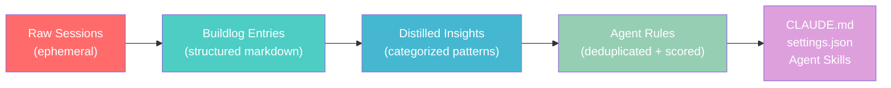
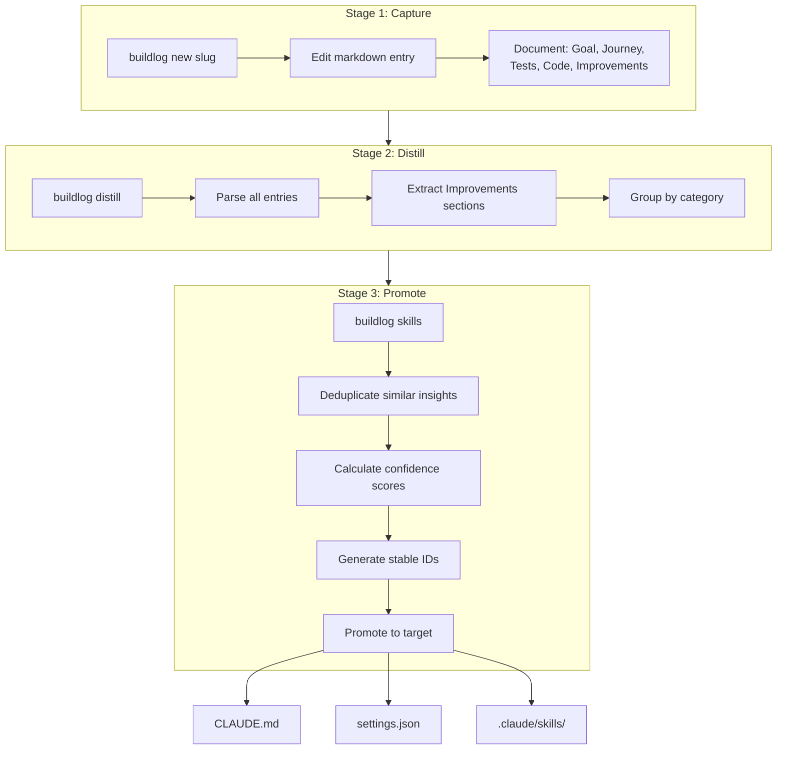
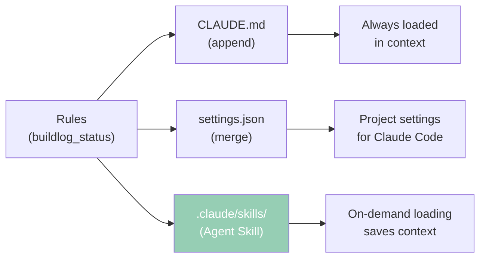
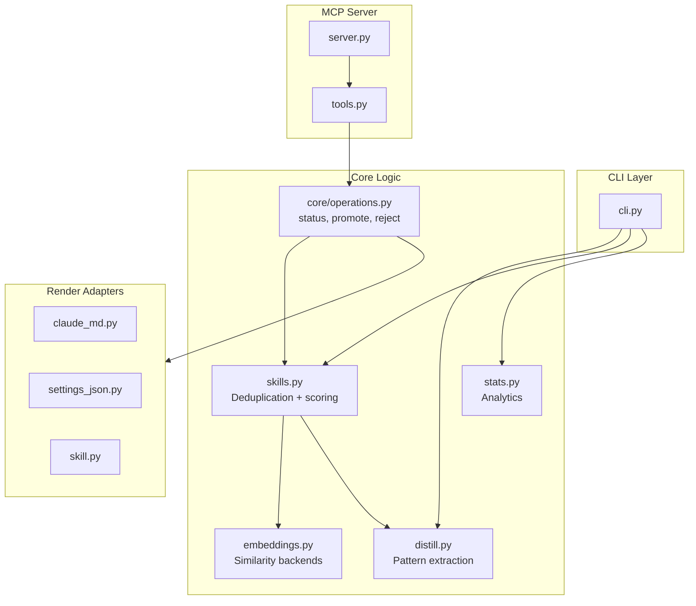

<div align="center">

# buildlog

### Engineering Notebook for AI-Assisted Development

[](https://pypi.org/project/buildlog/)
[](https://python.org/)
[](https://github.com/Peleke/buildlog-template/actions/workflows/ci.yml)
[](https://codecov.io/gh/Peleke/buildlog-template)
[](https://opensource.org/licenses/MIT)

**Capture your work as publishable content. Include the fuckups.**


[Quick Start](#-quick-start) · [The Pipeline](#-the-pipeline) · [Commands](#-commands) · [Philosophy](#-philosophy)

---

</div>

## The Problem

You're pairing with AI on real work. Hours of debugging, wrong turns, "oh shit" moments, and hard-won insights—all vanishing into chat history the moment you close the tab.

Meanwhile, your AI agent makes the same mistakes on similar problems because it has no memory of what you learned together.

## The Solution

**buildlog** captures the signal from AI-assisted development sessions and transforms it into:

1. **Publishable content** - Each entry is a $500+ tutorial draft
2. **Structured insights** - Categorized learnings ready for analysis
3. **Agent rules** - Deduplicated, confidence-scored rules that improve AI behavior



---

## Key Concepts

| Term | What it means |
|------|---------------|
| **Entry** | A structured markdown file documenting one work session |
| **Insight** | A single learning extracted from an entry's Improvements section |
| **Pattern** | Raw insights grouped by category (architectural, workflow, etc.) |
| **Rule** | Deduplicated insight with stable ID, confidence score, and source tracking |
| **Agent Skill** | Rules promoted to `.claude/skills/` for on-demand loading by Claude |

---

## Features

### Structured Capture
Templates with six required sections ensure you never forget to document the mistakes that teach the most.

### Pattern Distillation
Extract categorized insights from all your entries into structured JSON/YAML for analysis.

### Semantic Deduplication
"Run tests before commit" and "Always execute the test suite prior to committing" are the same insight. buildlog merges them.

### Confidence Scoring
Rules are scored based on frequency and recency. High-confidence rules have been reinforced multiple times recently.

### Multiple Promotion Targets
Promote rules to CLAUDE.md, settings.json, or **Anthropic Agent Skills** (`.claude/skills/`) for on-demand loading.

### Pluggable Embeddings
Token-based similarity by default. Upgrade to sentence-transformers or OpenAI for semantic understanding.

---

## Quick Start

```bash
# Install
pip install buildlog

# Initialize in your project
buildlog init

# Create an entry for today's work
buildlog new auth-api

# After a few entries, extract patterns
buildlog distill

# Generate deduplicated rules
buildlog skills
```

---

## The Pipeline

buildlog is a three-stage pipeline that transforms ephemeral work into durable knowledge:



### Stage 1: Capture (`buildlog new`)

Create structured entries as you work. Each entry has six sections:

| Section | Purpose |
|---------|---------|
| **The Goal** | What you're building and why |
| **What We Built** | Architecture diagram, components |
| **The Journey** | Chronological narrative *including mistakes* |
| **Test Results** | Actual commands, actual outputs |
| **Code Samples** | Key snippets with context |
| **Improvements** | Categorized learnings for next time |

The **Improvements** section is structured for machine extraction:

```markdown
### Architectural
- Always validate inputs at the boundary, not conditionally
- Use frozen dataclasses for immutable data containers

### Workflow
- Run the test suite after EVERY code change, not just at the end
- Write the integration test first to clarify the API contract

### Tool Usage
- The `patch` context manager for date mocking is cleaner than fixtures
- Use `jwt.io` to decode tokens instead of console.log

### Domain Knowledge
- `datetime.utcnow()` is deprecated in Python 3.12+
- Supabase storage returns 400, not 404, for missing files
```

### Stage 2: Distill (`buildlog distill`)

Extract all insights across entries into structured data:

```bash
buildlog distill                    # JSON to stdout
buildlog distill -o patterns.yaml   # Write to file
buildlog distill --since 2026-01-01 # Filter by date
buildlog distill --category workflow # Filter by category
```

Output:
```json
{
  "patterns": {
    "architectural": [
      {"insight": "Always validate inputs at boundary...", "source": "2026-01-16-auth.md"}
    ],
    "workflow": [...],
    "tool_usage": [...],
    "domain_knowledge": [...]
  },
  "statistics": {
    "total_patterns": 47,
    "by_category": {"architectural": 12, "workflow": 15, ...}
  }
}
```

### Stage 3: Generate Rules (`buildlog skills`)

Transform raw patterns into deduplicated, scored rules:

```bash
buildlog skills                           # YAML to stdout
buildlog skills -o rules.yml              # Write to file
buildlog skills --format markdown         # For CLAUDE.md injection
buildlog skills --min-frequency 2         # Only repeated patterns
buildlog skills --embeddings openai       # Semantic deduplication
```

Output:
```yaml
generated_at: '2026-01-16T12:00:00Z'
source_entries: 23
total_skills: 31
skills:
  architectural:
    - id: arch-b0fcb62a1e
      rule: Always validate inputs at the boundary, not conditionally
      frequency: 4
      confidence: high
      sources: [auth.md, api.md, validation.md, forms.md]
      tags: [api, error]
    - id: arch-0cda924aeb
      rule: Frozen dataclasses should be the default for data containers
      frequency: 2
      confidence: medium
      sources: [models.md, dto.md]
      tags: [python]
```

---

## Patterns vs Rules

**Patterns** are raw extractions—every insight from every entry, exactly as written.

**Rules** are processed patterns with:

| Property | Description |
|----------|-------------|
| **Stable ID** | Same rule always gets same ID (SHA-256 based) |
| **Deduplication** | Similar insights merged, frequency tracked |
| **Confidence** | high/medium/low based on frequency + recency |
| **Sources** | Which entries contributed to this rule |
| **Tags** | Auto-extracted technology/concept keywords |

### Deduplication in Action

Raw patterns from different entries:
```
- "Run tests before committing"
- "Always run the test suite before commit"
- "Execute tests prior to committing code"
```

After deduplication → **1 rule** with `frequency: 3`:
```yaml
- id: wf-96f12966f1
  rule: Run tests before committing
  frequency: 3
  confidence: high
```

---

## Promotion Targets

Rules can be promoted to different targets for agent consumption:



| Target | File | When to Use |
|--------|------|-------------|
| `claude_md` | `CLAUDE.md` | Rules always in context (default) |
| `settings_json` | `.claude/settings.json` | Project-level Claude Code settings |
| `skill` | `.claude/skills/buildlog-learned/SKILL.md` | **On-demand loading** - rules load only when relevant |

### Anthropic Agent Skills (New!)

The `skill` target creates an [Anthropic Agent Skill](https://docs.anthropic.com/en/docs/claude-code/skills) that Claude loads on-demand:

```bash
# Via MCP tool
buildlog_promote(skill_ids=["arch-123", "wf-456"], target="skill")
```

Creates `.claude/skills/buildlog-learned/SKILL.md`:

```markdown
---
name: buildlog-learned
description: Project-specific patterns learned from development history.
  Use when writing code, making architectural decisions, reviewing PRs,
  or ensuring consistency. Contains 12 rules across Architectural, Workflow.
---

# Learned Patterns

*12 rules extracted from buildlog entries on 2026-01-16*

## Must Follow (High Confidence)

These patterns have been reinforced multiple times.

### Architectural
- Always validate inputs at the boundary
- Use dependency injection for testability

### Workflow
- Run tests after EVERY code change

## Should Consider (Medium Confidence)

These patterns appear frequently but may have exceptions.

### Tool Usage
- Prefer `patch` context manager for date mocking
```

**Why Agent Skills?**
- **On-demand loading** - Rules only load when Claude determines they're relevant
- **Saves context** - Not always in context like CLAUDE.md
- **Progressive disclosure** - Claude asks before loading the full skill

### Live Usage Scenario

Here's how your learned rules actually get used:

```
┌─────────────────────────────────────────────────────────────────┐
│ You: "Review this authentication endpoint I wrote"              │
└─────────────────────────────────────────────────────────────────┘
                              │
                              ▼
┌─────────────────────────────────────────────────────────────────┐
│ Claude sees: "authentication" + "review" + "endpoint"           │
│                                                                 │
│ Checks skill description:                                       │
│   "Use when writing code, making architectural decisions,       │
│    reviewing PRs, or ensuring consistency..."                   │
│                                                                 │
│ Match! Loads .claude/skills/buildlog-learned/SKILL.md           │
└─────────────────────────────────────────────────────────────────┘
                              │
                              ▼
┌─────────────────────────────────────────────────────────────────┐
│ Claude now has access to YOUR learned rules:                    │
│                                                                 │
│   Must Follow:                                                  │
│   - Password hashing belongs in User model, not route handler   │
│   - Always validate inputs at the boundary                      │
│                                                                 │
│   Worth Knowing:                                                │
│   - bcrypt.compare() arg order is (plaintext, hash)             │
│   - JWT expiry is in seconds, not milliseconds                  │
└─────────────────────────────────────────────────────────────────┘
                              │
                              ▼
┌─────────────────────────────────────────────────────────────────┐
│ Claude: "I notice the password hashing is in your route         │
│ handler. Based on patterns from your buildlog, this should      │
│ be a pre-save hook in the User model instead.                   │
│                                                                 │
│ Also, I see bcrypt.compare(hash, password) - the argument       │
│ order should be (plaintext, hash). This has tripped you up      │
│ before."                                                        │
└─────────────────────────────────────────────────────────────────┘
```

Your past mistakes now prevent future ones—automatically.

---

## Embedding Backends

Deduplication uses text similarity. Choose your backend:

| Backend | Install | Use Case |
|---------|---------|----------|
| `token` (default) | Built-in | Fast, free, good for obvious duplicates |
| `sentence-transformers` | `pip install buildlog[embeddings]` | Local semantic similarity, no API calls |
| `openai` | `pip install buildlog[openai]` | Best quality, requires API key |

```bash
# Token-based (default) - catches "run tests" ≈ "run testing"
buildlog skills

# Semantic - catches "use Redis for caching" ≈ "cache data in Redis"
buildlog skills --embeddings sentence-transformers

# OpenAI - best quality semantic matching
export OPENAI_API_KEY=...
buildlog skills --embeddings openai
```

### Comparison

| Input | Token | OpenAI |
|-------|:-----:|:------:|
| "Run tests before commit" ≈ "Run testing before committing" | Merged | Merged |
| "Use Redis for caching" ≈ "Cache data in Redis" | Separate | Merged |

---

## Practical Usage

### 1. Inject Rules into CLAUDE.md

```bash
buildlog skills --format markdown >> CLAUDE.md
```

Your AI agent now has access to every lesson you've learned:

```markdown
## Learned Rules

Based on 23 buildlog entries, 31 actionable rules have emerged:

### Architectural (8 rules)
- Always validate inputs at the boundary (seen 4x)
- Use frozen dataclasses for data containers (seen 2x)

### Workflow (12 rules)
- Run tests after EVERY code change (seen 5x)
...
```

### 2. Create an Agent Skill

For on-demand loading instead of always-in-context:

```bash
# Via CLI (coming soon)
buildlog promote --target skill

# Via MCP
buildlog_promote(skill_ids=["arch-123"], target="skill")
```

### 3. Track Rule Evolution

Rules have stable IDs. Track which are reinforced over time:

```bash
# This week's new rules
buildlog skills --since 2026-01-10 -o this-week.yml

# Compare to baseline
diff baseline.yml this-week.yml
```

### 4. Find Your Blind Spots

```bash
buildlog stats --detailed
```

```
Buildlog Statistics

Entries: 23 total
Coverage: 87% with improvements

Category Breakdown:
  architectural:    12 insights (26%)
  workflow:         15 insights (33%)
  tool_usage:        8 insights (17%)
  domain_knowledge: 11 insights (24%)

Warnings:
  - 3 entries have empty Improvements sections
```

---

## Commands

| Command | Description |
|---------|-------------|
| `buildlog init` | Initialize in current directory |
| `buildlog new <slug>` | Create entry for today |
| `buildlog new <slug> --date 2026-01-15` | Create entry for specific date |
| `buildlog list` | List all entries |
| `buildlog distill` | Extract patterns from all entries |
| `buildlog stats` | Show statistics and analytics |
| `buildlog skills` | Generate deduplicated rules |
| `buildlog update` | Update templates to latest |

### Skills Options

```bash
--output, -o PATH       # Write to file instead of stdout
--format [yaml|json|markdown]  # Output format (default: yaml)
--min-frequency N       # Only rules seen N+ times
--since YYYY-MM-DD      # Only entries from this date
--embeddings [token|sentence-transformers|openai]  # Similarity backend
```

---

## Architecture



### Data Flow

```mermaid
flowchart LR
    MD["buildlog/*.md"] --> Parse["Parse markdown"]
    Parse --> Extract["Extract Improvements"]
    Extract --> Distill["distill_all()"]
    Distill --> Patterns["Patterns by category"]
    Patterns --> Dedup["Deduplicate"]
    Dedup --> Score["Calculate confidence"]
    Score --> Rules["Rules with IDs"]
    Rules --> Format["Format output"]
    Format --> Out["YAML / JSON / Markdown / Agent Skill"]
```



---

## Installation Options

```bash
# Basic install
pip install buildlog

# With local semantic embeddings (offline)
pip install buildlog[embeddings]

# With OpenAI embeddings
pip install buildlog[openai]

# Everything
pip install buildlog[all]

# Development
pip install buildlog[dev]

# With MCP server for Claude Code integration
pip install buildlog[mcp]
```

---

## MCP Server (Claude Code Integration)

The MCP server lets Claude Code interact with your buildlog rules directly. Your agent can review learned patterns, promote them to rules, or reject false positives—all through natural conversation.

### Setup for Claude Code CLI

1. Install with MCP support:
   ```bash
   pip install buildlog[mcp]
   # or with uv
   uv pip install buildlog[mcp]
   ```

2. Add to your Claude Code settings (`~/.claude/settings.json`):
   ```json
   {
     "mcpServers": {
       "buildlog": {
         "command": "buildlog-mcp",
         "args": []
       }
     }
   }
   ```

3. Start a new Claude Code session. The buildlog tools will be available.

### Available Tools

| Tool | Description |
|------|-------------|
| `buildlog_status` | Get rules grouped by category with confidence scores |
| `buildlog_promote` | Write rules to CLAUDE.md, settings.json, or **Agent Skills** |
| `buildlog_reject` | Mark rules to exclude from future suggestions |
| `buildlog_diff` | Show rules pending review (not yet promoted/rejected) |

### Promotion Targets via MCP

```python
# Append to CLAUDE.md (default)
buildlog_promote(skill_ids=["arch-123"], target="claude_md")

# Merge into settings.json
buildlog_promote(skill_ids=["arch-123"], target="settings_json")

# Create Anthropic Agent Skill (NEW!)
buildlog_promote(skill_ids=["arch-123"], target="skill")
```

### Example Conversation

```
You: What patterns have I learned?

Claude: [calls buildlog_status]
        Based on 23 buildlog entries, you have 31 rules:

        High confidence (ready to promote):
        - arch-b0fcb62a1e: "Always validate inputs at the boundary"
        - wf-96f12966f1: "Run tests before committing"

        Would you like me to add these to your CLAUDE.md or create an Agent Skill?

You: Create an Agent Skill so they load on-demand.

Claude: [calls buildlog_promote with target="skill"]
        Created skill at .claude/skills/buildlog-learned/SKILL.md

        This skill will load on-demand when relevant to your work,
        saving context for when you need it most.
```

---

## Philosophy

### 1. Write Fast, Not Pretty
Refrigerator to-do list energy. Get it down before you forget.

### 2. Never Delete Mistakes
Wrong turns are the most valuable content. They're what makes tutorials actually useful.

### 3. Include the Journey
"We tried X, it failed because Y, so we did Z" > "We did Z"

### 4. Capture Improvements
Concrete learnings, not vague observations. "Always validate at boundary" > "validation is important"

### 5. Quality Bar
Each entry should be publishable as a **$500+ tutorial**. Real error messages. Honest about what didn't work. Code that runs.

---

## Contributing

1. Fork the repository
2. Create a feature branch (`git checkout -b feature/amazing`)
3. Commit your changes (`git commit -m 'Add amazing feature'`)
4. Push to the branch (`git push origin feature/amazing`)
5. Open a Pull Request

---

## License

MIT License — see [LICENSE](./LICENSE) for details.

---

<div align="center">

**Your AI pair programmer should learn from your mistakes.**

**buildlog makes that possible.**

[Back to top](#buildlog)

</div>
