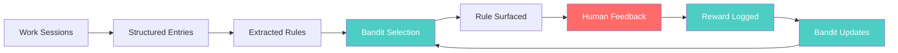

# Quick Start

This walks through the full buildlog pipeline: capture, extract, promote, measure, learn.

!!! note "Upgrading from an older version?"
    If you have an existing project with legacy `.buildlog/` JSON/JSONL files, run
    `buildlog migrate` to move your data into the new global SQLite database. This is
    a one-time, non-destructive operation. See [Storage Architecture](../guides/storage-architecture.md)
    for details.

## Stage 1: Capture

Document your work. Include the mistakes — they're the most valuable signal.

```bash
buildlog new auth-api
# Edit the markdown, document what happened
```

## Stage 2: Extract

Pull structured rules from your entries.

```bash
buildlog distill    # Extract patterns
buildlog skills     # Deduplicate into rules
```

## Stage 3: Promote

Surface rules to your agent via CLAUDE.md, settings.json, or Agent Skills.

```bash
buildlog status                          # See what's ready
buildlog promote <skill-ids> --target skill  # Surface to agent
```

## Stage 4: Measure

Track what happens when rules are active.

```bash
buildlog experiment start --error-class "type-errors"
# ... work session ...
buildlog experiment log-mistake --error-class "type-errors" \
  --description "Forgot to handle null case"
buildlog experiment end
buildlog experiment report
```

## Stage 5: Learn

Log reward signals when rules help (or don't).

```python
# Via MCP
buildlog_log_reward(
    skill_id="arch-123",
    reward=1,           # 1 = helped, 0 = didn't help
    context="type-errors",
    outcome="Caught the bug before commit"
)
```

## The pipeline



*Thompson Sampling closes the loop: rules are selected based on learned effectiveness, and feedback updates the model.*
