# Storage Architecture

buildlog uses a global SQLite database as its primary storage backend. All project
data lives in a single file, with project isolation enforced by hashed project IDs.
Legacy per-project JSON/JSONL files are still supported as a read-only fallback.

## Global Database

The database lives at:

```
~/.buildlog/buildlog.db
```

SQLite is configured with **WAL mode** (Write-Ahead Logging) for concurrent read
access and reliable writes. The database is created automatically the first time
buildlog runs in any project.

## StorageBackend Protocol

All storage access goes through the `StorageBackend` protocol, which defines a
uniform interface for reading and writing buildlog data. There are two implementations:

| Backend | Location | Use Case |
|---------|----------|----------|
| `SQLiteBackend` | `~/.buildlog/buildlog.db` | Default for all new and migrated projects |
| `LegacyBackend` | `.buildlog/*.json`, `.buildlog/*.jsonl` | Read-only fallback for unmigrated projects |

The active backend is resolved automatically at startup. You do not need to configure
which backend to use.

## Backend Resolution

When buildlog starts, it determines which backend to use for the current project:



The four resolution cases in order:

1. **Global DB exists + project registered** -- `SQLiteBackend`. The standard path.
2. **Global DB exists, project not registered** -- auto-register the project, then `SQLiteBackend`. Happens the first time you open a new repo after installing buildlog.
3. **No global DB but legacy `.buildlog/` has files** -- `LegacyBackend`. The system reads existing JSON/JSONL files directly. Run `buildlog migrate` to move to SQLite.
4. **Nothing exists** -- create the global DB, register the project, `SQLiteBackend`. Clean-slate setup.

## Project ID Derivation

Each project needs a stable, unique identifier for isolation within the shared database.
buildlog derives project IDs using a two-tier strategy:

| Source | Method | When Used |
|--------|--------|-----------|
| Git remote URL | SHA-256 hash of the remote origin URL | Preferred. Portable across machines if the remote is the same. |
| Absolute path | SHA-256 hash of the project's absolute filesystem path | Fallback when no git remote is configured. |

The git-remote-based ID means the same repository cloned on different machines will
share the same project ID, which enables future multi-machine sync scenarios. The
path-based fallback ensures non-git projects still work.

## Migration

The `buildlog migrate` command converts legacy per-project JSON/JSONL files into the
global SQLite database.

```bash
buildlog migrate             # migrate current project
buildlog migrate --dry-run   # preview without writing
```

### Data Flow



### Safety Guarantees

- **Non-destructive.** Legacy files are renamed to `*.migrated` (e.g., `reward_events.jsonl` becomes `reward_events.jsonl.migrated`). The original data is preserved on disk.
- **Idempotent.** Running `migrate` multiple times is safe. Already-migrated data is skipped. Files already renamed to `*.migrated` are not processed again.
- **Dry run.** Use `--dry-run` to see exactly what would be migrated before committing to the operation.

After migration, the project is registered in the global database and all subsequent
reads and writes go through `SQLiteBackend`.

## Export

The `buildlog export` command dumps data from the global SQLite database into JSONL
files for portability, backup, or external analysis.

```bash
buildlog export                              # export everything for current project
buildlog export --output ./backup            # write to a specific directory
buildlog export --project <id>               # export a specific project
buildlog export --tables rewards,skills      # export only specific tables
buildlog export --format jsonl               # explicit format (jsonl is the default)
```

Each table is exported as a separate `.jsonl` file, one JSON object per line. The
output directory defaults to the current working directory.

## When to Migrate

- **New installations** do not need to migrate. The global SQLite database is created automatically.
- **Existing projects** with a `.buildlog/` directory containing JSON/JSONL files should run `buildlog migrate` once. After that, all data lives in the global database.
- **CI environments** that rely on `.buildlog/` files may continue using the legacy backend. The `LegacyBackend` fallback is not going away.
