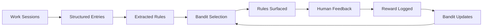

# buildlog

## Engineering insights that compound

Capture what works. Measure whether it actually helped. Drop what didn't.

---

buildlog extracts decision patterns from your AI-assisted work and uses a [Thompson Sampling contextual bandit](theory/index.md) to surface rules that reduce mistakes — then tracks whether they did. The feedback loop is statistical, not vibes-based.

## Features

- **Capture** — structured journal entries from work sessions, mistakes included
- **Extract** — distill entries into reusable engineering rules with semantic deduplication
- **Select** — Thompson Sampling bandit automatically surfaces the most effective rules per context
- **Measure** — track Repeated Mistake Rate (RMR) across experiments with statistical rigor
- **Review** — run code through curated reviewer personas (Security Karen, Test Terrorist, Bragi)
- **Integrate** — works with Claude Code, Cursor, GitHub Copilot, Windsurf, and Continue.dev

## Quick install

```bash
uv pip install buildlog        # or: pip install buildlog
buildlog init-mcp --global -y  # register globally for all projects
```

## Quick start

```bash
buildlog init                  # scaffold a project
buildlog new my-feature        # capture a work session
buildlog distill               # extract patterns
buildlog skills                # deduplicate into rules
buildlog experiment start      # begin tracked session (bandit selects rules)
# ... work ...
buildlog experiment end        # close session
buildlog experiment report     # see the numbers
```

## The pipeline



*Thompson Sampling closes the loop: rules are selected based on learned effectiveness, and feedback updates the model.*

## Next steps

- [Installation](getting-started/installation.md) — setup details and optional extras
- [Quick Start](getting-started/quick-start.md) — the full pipeline walkthrough
- [Core Concepts](getting-started/concepts.md) — the problem, the claim, and the metric
- [Theory](theory/index.md) — from restaurant intuition to contextual bandits
- [Roadmap](roadmap.md) — embedding search, rule graphs, and what's next
