# buildlog

## Engineering insights that compound

Capture what works. Measure whether it actually helped. Drop what didn't.

---

buildlog extracts decision patterns from your AI-assisted work and uses a [Thompson Sampling contextual bandit](theory/index.md) to surface rules that reduce mistakes, then tracks whether they did. The feedback loop is statistical, not vibes-based.

## See it working

The **[Learning Loop E2E Trace](LEARNING-LOOP-E2E.md)** walks through all 13 steps of the pipeline with explicit code citations. From installation through Thompson Sampling selection, gauntlet review, Bayesian bandit updates, emission pipeline, cross-domain discovery via [qortex](https://github.com/Peleke/qortex) (a separate knowledge graph package in the ecosystem), and rule re-export back into buildlog.

Every claim on this page has a mechanical proof in that document.

## Features

- **Capture** structured journal entries from work sessions, mistakes included
- **Extract** entries into reusable engineering rules with semantic deduplication
- **Select** rules via Thompson Sampling bandit, automatically surfacing the most effective per context
- **Measure** Repeated Mistake Rate (RMR) via category-aware repeat detection and rule overlap matching
- **Review** code through curated reviewer personas (Security Karen, Test Terrorist, Bragi)
- **Emit** structured artifacts to `~/.buildlog/emissions/` for downstream systems
- **Bridge** into [qortex](https://github.com/Peleke/qortex) for cross-domain pattern discovery across projects
- **Integrate** with Claude Code, Cursor, GitHub Copilot, Windsurf, and Continue.dev

## Quick install

```bash
uv pip install buildlog        # or: pip install buildlog
buildlog init-mcp --global -y  # register globally for all projects
```

## Quick start

```bash
buildlog init                         # scaffold a project
buildlog new my-feature               # capture a work session
buildlog commit -m "feat: add auth"   # commit with entry logging
buildlog gauntlet-loop --target src/  # review with curated personas
buildlog log-reward --outcome accepted  # close the feedback loop
```

For longitudinal RMR tracking across many sessions (optional):

```bash
buildlog experiment start      # begin tracked session (bandit selects rules)
# ... work ...
buildlog experiment end        # close session
buildlog experiment report     # see the numbers
```

## The pipeline



*Thompson Sampling closes the loop: rules are selected based on learned effectiveness, and feedback updates the model.*

## The ecosystem

buildlog is one piece. [**qortex**](https://github.com/Peleke/qortex) is a separate package that provides the knowledge graph layer. buildlog emits structured artifacts; qortex ingests them, bridges rules to design pattern domains, discovers cross-domain relationships that no individual system can see, and projects new rules back. The [Learning Loop E2E Trace](LEARNING-LOOP-E2E.md) documents exactly how this works at the code level (see sections 10-11).

```
buildlog emits    ──>  qortex ingests  ──>  graph discovers patterns
     ^                                              |
     └──────── qortex projects new rules  <─────────┘
```

## Next steps

- [Installation](getting-started/installation.md) for setup details and optional extras
- [Quick Start](getting-started/quick-start.md) for the full pipeline walkthrough
- [Core Concepts](getting-started/concepts.md) for the problem, the claim, and the metric
- **[Learning Loop E2E](LEARNING-LOOP-E2E.md)** for the 13-step proof with code citations
- [qortex Integration](guides/qortex-integration.md) for the emission protocol and cross-domain bridging
- [Theory](theory/index.md) from restaurant intuition to contextual bandits
- [Roadmap](roadmap.md) for embedding search, rule graphs, and what's next
