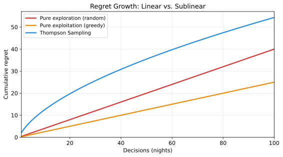

# The Price of Learning

## Every choice has a cost

Back to the restaurants. Suppose you could magically know, before visiting any of them, that Restaurant #7 is the best. You'd go there every night. 30 perfect meals.

But you *can't* know that without trying them. And every night you spend at a worse restaurant is a night you didn't spend at #7.

**Regret** is the gap between what you got and what you could have gotten if you'd known the answer from the start.

```
regret(night) = reward(best restaurant) - reward(restaurant you chose)
```

Over 30 nights, your **total regret** is the sum of all those gaps:

```
total_regret = sum over all nights of (best_reward - actual_reward)
```

You can't make regret zero — that would require knowing the answer before you start. But you can make it grow as slowly as possible.

## Three strategies, three regret curves

### Strategy 1: Pure exploitation (always go to the first good place)

Night 1: try a random place. It's a 7/10. Night 2-30: go back every night.

**Problem:** Restaurant #7 is a 9.5/10, but you'll never find it. Your regret accumulates steadily because you locked in too early.

Total regret: **(best - 7/10) x 29 nights.** Linear growth. Bad.

### Strategy 2: Pure exploration (try a new place every night)

Night 1-10: try every restaurant once. Night 11-30: keep rotating randomly.

**Problem:** You found Restaurant #7 on night 4. It was amazing. But you keep trying other places anyway. You're *wasting* nights on places you already know are worse.

Total regret: **high variance, doesn't converge.** You learn everything but use nothing.

### Strategy 3: Smart exploration (explore, then exploit)

Night 1-5: try 5 places. Night 6-30: mostly go to the best one, occasionally try a new one.

**Problem:** Actually, this one works pretty well. But "occasionally" is doing a lot of work. How occasionally? And which new ones?

This is where the math helps.



## How fast can regret grow?

Theoretical computer science gives us bounds on how well any algorithm can do:

| Strategy | Regret growth | Intuition |
|----------|--------------|-----------|
| Random | O(T) | Linear — you never learn |
| Greedy | O(T) | Linear — you learn wrong thing fast |
| Epsilon-greedy | O(T) | Linear — the epsilon term never stops |
| UCB1 | O(sqrt(KT log T)) | Sublinear — slows down over time |
| Thompson Sampling | O(sqrt(KT log K)) | Sublinear — among the best known |

**T** is the number of decisions (nights). **K** is the number of options (restaurants).

The key insight: **sublinear regret** means the algorithm gets *better* over time. The per-decision regret approaches zero as you accumulate data. You never stop paying the price of learning, but the price gets smaller and smaller.

Thompson Sampling achieves near-optimal regret bounds while being simple to implement and natural to reason about. That's why buildlog uses it.

## Regret in buildlog

In buildlog's bandit, regret maps to:

| Restaurant analogy | buildlog equivalent |
|--------------------|---------------------|
| Best restaurant | The optimal set of rules for this context |
| Restaurant you chose | The rules the bandit actually selected |
| Meal quality | Whether the rules prevented repeated mistakes |
| One night | One coding session |
| Total regret | Cumulative missed mistake-prevention over all sessions |

You can't measure regret directly (you'd need to know the optimal rules, which is what you're trying to learn). But you *can* measure its proxy: **Repeated Mistake Rate (RMR)**. If the bandit is learning, RMR decreases over time — which means regret is growing sublinearly. The system is converging.

## The exploration budget

Regret isn't a bug. It's a budget.

You're *spending* regret to *buy* information. The question is whether you're getting a good deal. Trying a new restaurant that turns out to be terrible isn't waste — it's data. You now know to avoid it, and every future decision benefits.

The trick is spending your exploration budget *efficiently*:

- Don't explore places you already know are bad
- Explore more when you're uncertain, less when you're confident
- Stop exploring an option once you have enough data to judge it

This requires keeping track of how uncertain you are about each option. And that brings us to the tool for representing uncertainty: the [Beta distribution](beta-distributions.md).

## Key takeaway

Regret is the unavoidable cost of learning. Good algorithms minimize it by exploring efficiently — spending uncertainty-reduction budget where it's most needed and converging on good options as data accumulates. The theoretical guarantee is that regret grows sublinearly: you keep learning, and the cost of learning keeps shrinking.

## Next

- [Keeping Score](beta-distributions.md) — Representing uncertainty with Beta distributions
