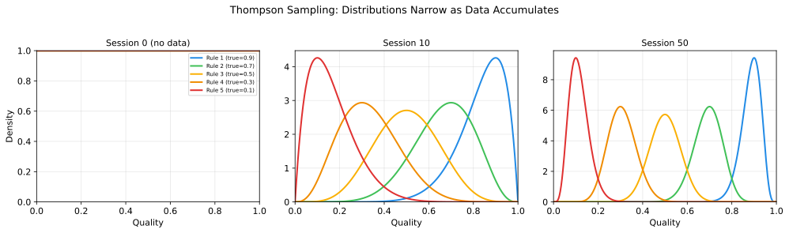

# Making Decisions

## The problem with "just pick the best one"

You have Beta distributions for all 10 restaurants. Restaurant A has the highest mean. So you should always pick A, right?

No. Here's why.

Restaurant A: Beta(5, 2), mean 0.71. You've been there 5 times.

Restaurant C: Beta(2, 1), mean 0.67. You've been there once.

A has a higher mean, but C has massive uncertainty. C *could* be a 0.95. You just don't have enough data to know. If you always pick the highest mean, you'll never find out.

This is the **greedy trap**: you lock into the locally best option and never discover the globally best one.

## Three approaches

### Greedy (always pick the highest mean)

```
pick = argmax(mean(arm) for arm in arms)
```

Fast convergence to a *local* optimum. You find something good and stick with it forever. The problem: "good" isn't "best." Linear regret.

### Epsilon-greedy (usually pick the best, sometimes explore randomly)

```
if random() < epsilon:
    pick = random_choice(arms)
else:
    pick = argmax(mean(arm) for arm in arms)
```

Better — you do explore. But the exploration is *blind*. You're equally likely to revisit a restaurant you already know is terrible as one you haven't tried. And you never stop: even after 1000 nights, you're still randomly exploring 10% of the time. Linear regret (the epsilon term never goes away).

### Thompson Sampling (sample from each distribution, pick the highest sample)

```
for arm in arms:
    arm.score = sample_from_beta(arm.alpha, arm.beta)
pick = argmax(arm.score for arm in arms)
```

This is the one. Let's break down why it works.

## Why sampling is the right idea

When you sample from Beta(5, 2) (Restaurant A, well-known), you'll usually get a value near 0.71. The distribution is narrow. Not much variance in the samples.

When you sample from Beta(2, 1) (Restaurant C, barely explored), you might get 0.3 or 0.9. The distribution is wide. Lots of variance.

So what happens when you sample from all 10 distributions and pick the highest?

- **Well-known good restaurants** sample near their (high) mean most of the time. They win most rounds. This is exploitation.
- **Barely explored restaurants** occasionally sample very high because their distributions are wide. They win some rounds. This is exploration.
- **Well-known bad restaurants** sample near their (low) mean. They almost never win. No wasted exploration.

The algorithm *automatically* explores uncertain options and exploits known-good ones. No epsilon parameter to tune. No schedule to manage. The exploration-exploitation balance emerges from the uncertainty in the data.

**As you accumulate data, distributions narrow. Narrow distributions sample near their mean. Exploration naturally decreases.** The algorithm converges to pure exploitation of the best option — but only once it has enough evidence to be confident.

## The algorithm in buildlog

Here's how Thompson Sampling works in buildlog's bandit (simplified from `src/buildlog/core/bandit.py`):

```
function select_rules(rules, posteriors, config):
    # Step 1: Score each rule by sampling from its posterior
    for rule in rules:
        posterior = posteriors[rule.id] or initial_prior(rule)
        rule.score = sample_beta(posterior.alpha, posterior.beta)

    # Step 2: Sort by score (highest first)
    sort(rules, by=score, descending)

    # Step 3: Select top-k rules
    selected = rules[:config.max_rules]

    return selected
```

After a session:

```
function update(rule, outcome):
    if outcome == "helped":
        posteriors[rule.id].alpha += 1    # success
    else:
        posteriors[rule.id].beta += 1     # failure
```

That's the entire learning loop. Sample, select, observe, update.

## Watching it converge

Imagine 5 rules with true effectiveness rates of 0.9, 0.7, 0.5, 0.3, and 0.1. All start at Beta(1, 1).



| Sessions | Rule 1 (0.9) | Rule 2 (0.7) | Rule 3 (0.5) | Rule 4 (0.3) | Rule 5 (0.1) |
|----------|-------------|-------------|-------------|-------------|-------------|
| 0 | Beta(1,1) | Beta(1,1) | Beta(1,1) | Beta(1,1) | Beta(1,1) |
| 10 | Beta(10,2) | Beta(8,4) | Beta(6,6) | Beta(4,8) | Beta(2,10) |
| 50 | Beta(46,6) | Beta(36,16) | Beta(26,26) | Beta(16,36) | Beta(6,46) |

After 50 sessions:

- Rule 1: mean 0.88, narrow distribution. Almost always selected.
- Rule 5: mean 0.12, narrow distribution. Almost never selected.
- Rules 2-4: sorted by the data, correctly ranked.

The bandit figured it out. No human had to label which rules were good. The feedback loop did the work.

## Comparison with alternatives

| Property | Thompson Sampling | Epsilon-Greedy | UCB1 |
|----------|-------------------|----------------|------|
| Exploration strategy | Posterior sampling | Random | Upper confidence bound |
| Adapts over time | Yes (distributions narrow) | No (epsilon is fixed) | Yes (bounds tighten) |
| Prior knowledge | Yes (Beta priors) | No | No |
| Regret bound | O(sqrt(KT log K)) | O(T) | O(sqrt(KT log T)) |
| Implementation | ~20 lines | ~5 lines | ~15 lines |
| Tuning required | Prior selection only | Epsilon value | None |

Thompson Sampling and UCB1 are theoretically similar. Thompson Sampling wins in practice because:

1. **It's Bayesian**: you can encode prior knowledge (curated rules start optimistic)
2. **It's stochastic**: the randomness helps escape local optima
3. **It's natural**: sampling from beliefs is how humans reason under uncertainty

## One thing missing

Thompson Sampling as described above treats every session the same. But you wouldn't use the same rule set for type-checking tasks and API design tasks. The best rules depend on what you're working on.

When the best arm depends on the *situation*, you have a [contextual bandit](contextual-bandits.md).

## Key takeaway

Thompson Sampling works by letting uncertainty drive exploration. Sample from your beliefs, pick the best sample, observe the outcome, update your beliefs. Uncertain options get explored because their samples are volatile. Known-good options get exploited because their samples are consistently high. The balance happens automatically.

## Next

- [Context Changes Everything](contextual-bandits.md) — Why the same rule isn't always the right rule
